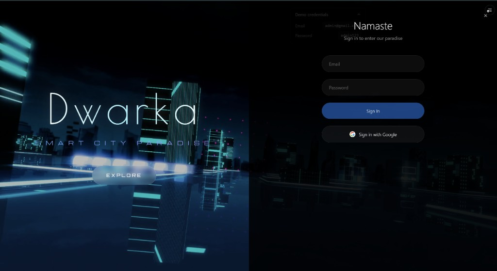
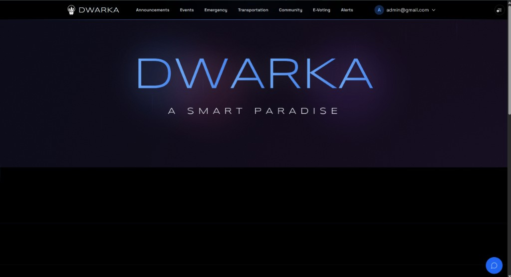
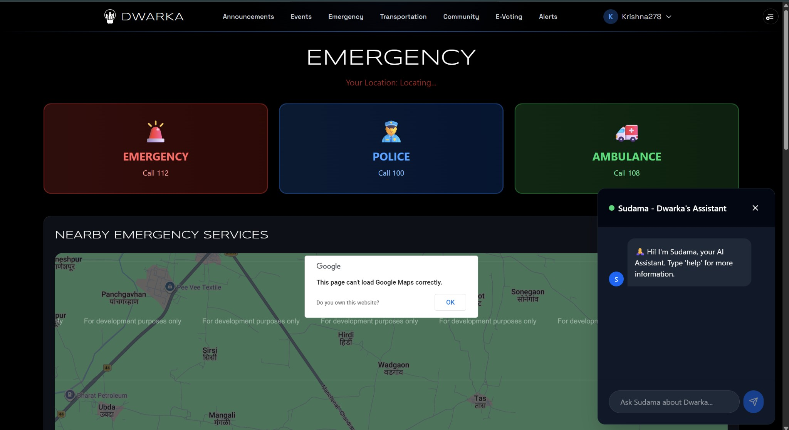
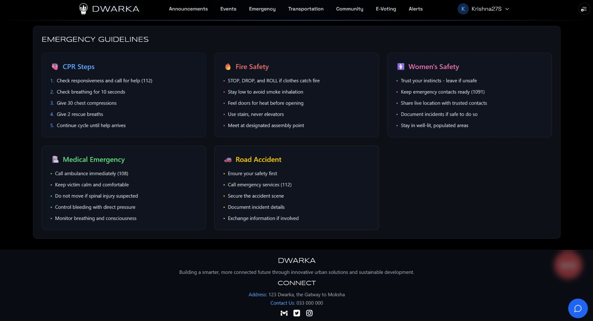
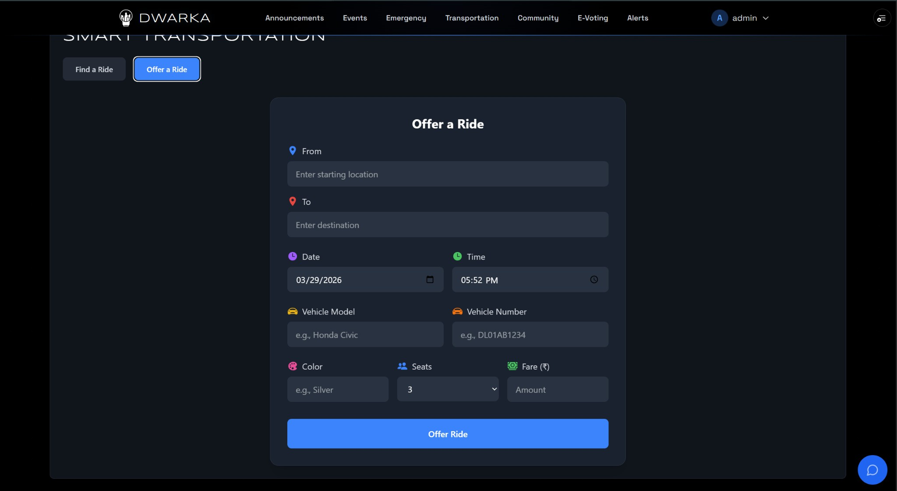

<div align="center">
  <h1>🏙️ Atlantis - Smart City Management Platform</h1>
  <p>A comprehensive, real-time Smart City web application designed to enhance citizen-municipal connectivity, streamline public services, and foster community engagement.</p>

  <!-- Badges -->
  <p>
    
    
    
    
    
    
    
  </p>
</div>

---

## 📋 Table of Contents
- [About the Project](#-about-the-project)
- [Key Features](#-key-features)
- [Technology Stack](#-technology-stack)
- [Local Development Setup](#-local-development-setup)
- [Project Structure](#-project-structure)
- [Available Scripts](#-available-scripts)

---

## 📖 About the Project

**Atlantis** is built to bridge the gap between citizens and municipal authorities. By leveraging modern real-time web technologies and AI, Atlantis provides a unified portal for everything from day-to-day community chats to emergency FIR reporting and decentralized e-voting.

---

## 🚀 Key Features

### 📸 Application Gallery

<details>
<summary><b>Click to View Screenshots</b></summary>
<br>

| Login Portal | Main Dashboard |
| :---: | :---: |
|  |  |

| Emergency Services & AI | Emergency Guidelines |
| :---: | :---: |
|  |  |

| Smart Transportation & P2P Rides |
| :---: |
|  |

</details>

* **🤖 AI-Powered Assistant (Sudama):** Context-aware chatbot utilizing **Gemini AI** and **HuggingFace** for intelligent intent recognition. It guides users through municipal services and automatically routes critical "SOS" commands to emergency dispatch flows.
* **🚗 Smart Transportation (P2P Ride-Sharing):** A real-time peer-to-peer ride-sharing network powered by **Socket.io**, allowing sub-second synchronization for location-based driver matching and ride requests via the **Google Maps API**.
* **🗳️ E-Voting Dashboard:** A decentralized portal for citizens to raise, discuss, and vote on active city issues. Top-voted issues are seamlessly escalated for municipal review.
* **🚨 Emergency Services & Online FIR:** A secure, multi-step incident reporting system allowing citizens to file First Information Reports (FIRs) and request immediate emergency assistance.
* **💬 Live Community Forum:** A real-time, authenticated community channel for citizens to connect, share local updates, and communicate synchronously.

---

## 🛠️ Technology Stack

### **Frontend:**
- **Core:** React 19, TypeScript, Vite
- **Styling & UI:** Tailwind CSS (v4), Framer Motion & GSAP (for fluid animations)
- **Routing:** React Router (v7)

### **Backend & Cloud Services:**
- **Server:** Node.js & Express (Custom WebSockets Server)
- **Real-Time Data:** Socket.io
- **Backend-as-a-Service:** Firebase (Authentication, Database, Hosting)
- **External APIs:** Google Maps API, Gemini AI API, HuggingFace (NLP), EmailJS (Automated notifications)

---

## ⚙️ Local Development Setup

Follow these steps to set up the project locally.

### Prerequisites
* Node.js (v18 or higher recommended)
* npm or yarn

### Installation

1. **Clone the repository:**
   ```bash
   git clone https://github.com/your-username/Atlantis-Smartcity.git
   cd Atlantis-Smartcity-modified
   ```

2. **Install dependencies:**
   ```bash
   npm install
   ```

3. **Configure Environment Variables:**
   Create a `.env` file in the root directory and configure your necessary API keys:
   ```env
   VITE_FIREBASE_API_KEY=your_firebase_api_key
   VITE_FIREBASE_AUTH_DOMAIN=your_firebase_auth_domain
   VITE_FIREBASE_PROJECT_ID=your_firebase_project_id
   VITE_FIREBASE_STORAGE_BUCKET=your_firebase_storage_bucket
   VITE_FIREBASE_MESSAGING_SENDER_ID=your_firebase_messaging_sender_id
   VITE_FIREBASE_APP_ID=your_firebase_app_id
   VITE_GEMINI_API_KEY=your_gemini_api_key
   VITE_GOOGLE_MAPS_API_KEY=your_google_maps_api_key
   ```

### Running the Application

This project requires both the Vite frontend development server and the custom Node/Express Socket.io server to run simultaneously.

1. **Start the Backend Server** (handles real-time chat & transportation):
   ```bash
   npm run server
   ```
   *The server will start on `http://localhost:3001`*

2. **Start the Frontend App** (in a new terminal):
   ```bash
   npm run dev
   ```
   *The app will start on `http://localhost:5173`*

---

## 📁 Project Structure

```text
├── server/                 # Express & Socket.io backend server
├── src/
│   ├── assets/             # Static assets, SVG logos
│   ├── components/         # React Components (UI, Chatbot, Forms, Views)
│   │   ├── EVoting/        # E-Voting portal components
│   │   ├── Emergency/      # FIR and Emergency response components
│   │   ├── Transportations/# Ride-sharing and map components
│   │   └── Community/      # Real-time chat components
│   ├── contexts/           # React Context (Auth)
│   ├── firebase/           # Firebase config and utilities
│   ├── hooks/              # Custom React hooks
│   ├── services/           # External API services (Gemini, Transportation, Notifications)
│   └── types/              # TypeScript interfaces and types
├── package.json            # Project metadata and dependencies
└── vite.config.ts          # Vite bundler configuration
```

---

## 📜 Available Scripts

In the project directory, you can run:

* `npm run dev` — Starts the Vite development server.
* `npm run server` — Starts the backend Socket.io server using `tsx`.
* `npm run build` — Builds the frontend for production to the `dist` folder.
* `npm run lint` — Runs ESLint to check for code quality and formatting.
* `npm run preview` — Locally previews the production build.
